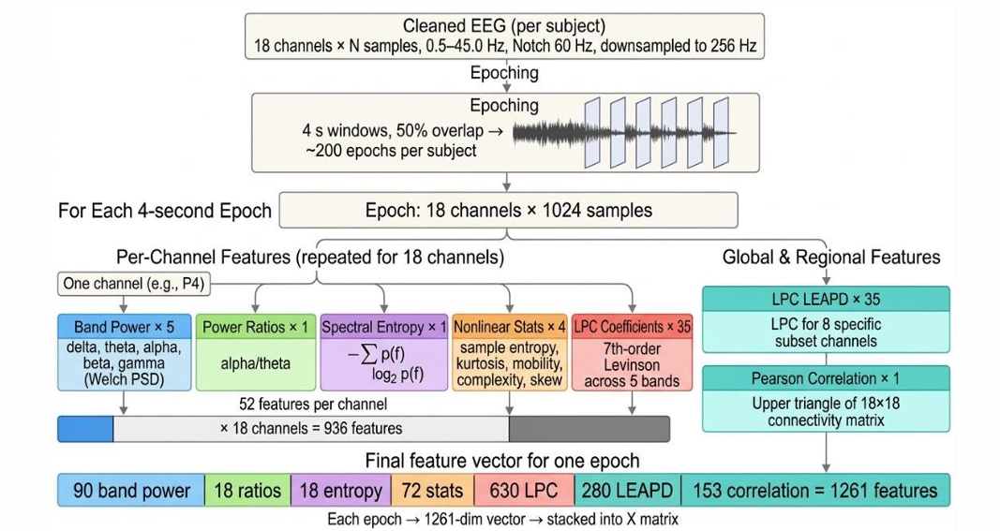

# EEG-Based Machine Learning Framework for Early Alzheimer's Disease Classification

[](https://www.python.org/downloads/)
[](LICENSE)
[]()

> A comprehensive machine learning pipeline leveraging multi-domain EEG spectral and nonlinear features to classify Alzheimer's disease patients from healthy controls with 78.1% accuracy using rigorous subject-independent validation.

**Author:** Ramanuja Kuntla  
**Advisor:** Dr. Kwok Tsui  
**Institution:** University of Texas at Arlington  
**Program:** Master's in Applied Statistics & Data Science

---

## 📖 Table of Contents

- [Background & Motivation](#background--motivation)
- [The Challenge](#the-challenge)
- [Our Approach](#our-approach)
- [Dataset](#dataset)
- [Feature Engineering](#feature-engineering)
- [Machine Learning Pipeline](#machine-learning-pipeline)
- [Results](#results)
- [Clinical Implications](#clinical-implications)
- [Future Directions](#future-directions)
- [References](#references)
- [Acknowledgments](#acknowledgments)

---

## 🧠 Background & Motivation

### The Growing Crisis

Alzheimer's disease (AD) affects over **55 million people worldwide** and is projected to reach **78 million by 2030**. The global economic burden exceeds **$1.3 trillion annually**, with costs expected to double by 2030. Early detection is critical for:

- **Maximizing therapeutic efficacy** in the disease's earliest stages
- **Enabling timely care planning** for patients and families
- **Supporting clinical trial enrollment** for breakthrough treatments
- **Reducing long-term healthcare costs** through early intervention

### Current Diagnostic Limitations

Traditional gold-standard methods face significant barriers:

| Method | Limitation |
|--------|------------|
| **Amyloid PET Scans** | $5,000-8,000 per scan; limited availability |
| **CSF Biomarker Analysis** | Invasive lumbar puncture; patient discomfort |
| **MRI/Structural Imaging** | Expensive infrastructure; late-stage detection |

These methods are **costly, invasive, and inaccessible** for population-level screening, particularly in resource-limited settings.

### Why EEG?

Electroencephalography (EEG) offers a compelling alternative:

✅ **Non-invasive** - Simple scalp electrodes, no radiation  
✅ **Cost-effective** - $200-500 vs. $5,000+ for PET  
✅ **Portable** - Suitable for clinics, homes, remote areas  
✅ **High temporal resolution** - Captures millisecond-level neural dynamics  
✅ **Repeatable** - Enables longitudinal monitoring  

**Key Insight:** AD produces characteristic "spectral slowing" in EEG—increased delta/theta power and decreased alpha/beta power—reflecting underlying neurodegeneration.

---

## 🎯 The Challenge

Despite EEG's promise, prior research has three critical gaps:

1. **Narrow Feature Sets** - Most studies use only band power, missing rich nonlinear dynamics
2. **Data Leakage** - Standard k-fold cross-validation mixes epochs from the same subject across train/test splits, inflating accuracy
3. **Lack of Systematic Comparison** - Few studies benchmark multiple ML models under identical conditions

**Our Goal:** Build a comprehensive, leakage-free ML framework that captures the full spectrum of AD-related neural changes.

---

## 🔬 Our Approach

### Three Core Innovations

1. **Multi-Domain Feature Engineering (1,261 features)**
   - Spectral, temporal, nonlinear, connectivity, and predictive coding features
   - Captures complementary aspects of neural dysfunction

2. **Rigorous Validation (LOSO Cross-Validation)**
   - Leave-One-Subject-Out ensures complete subject independence
   - Inner GroupKFold prevents leakage during hyperparameter tuning

3. **Systematic Benchmarking (5 Classifiers)**
   - Logistic Regression, LDA, SVM RBF, Random Forest, XGBoost
   - Identifies optimal model for clinical deployment

---

## 📊 Dataset

### Participants

- **Total Subjects:** 32 older adults (age ≥55)
  - **Alzheimer's Disease (AD):** 15 patients
  - **Healthy Controls (HC):** 17 participants

### EEG Recording Protocol

- **Channels:** 18 scalp electrodes (10-20 system)
  - Frontal: Fp1, Fp2, F3, Fz, F4, F7, F8
  - Central: C3, Cz, C4
  - Temporal: T3/T7, T4/T8
  - Parietal: P3, P4, P7, P8
  - Occipital: O1, O2
  
- **Recording Parameters:**
  - Sampling rate: 500 Hz
  - Bandwidth: 0-104 Hz
  - Duration: ~420 seconds (7 minutes)
  - Condition: Eyes-closed resting state

### Preprocessing

```
Raw EEG → Band-pass Filter (1-45 Hz) → Artifact Rejection → 2-sec Epochs
```

- **Filter:** 4th-order Butterworth
- **Epoch Length:** 2 seconds (non-overlapping)
- **Total Epochs:** ~6,520 across all subjects (~204 per subject)

**Data Source:** Provided by research advisor Dr. Kwok Tsui

---

## ⚙️ Feature Engineering

### The Story Behind Our Features

Alzheimer's disease doesn't just slow down brain waves—it fundamentally disrupts neural communication. To capture this complexity, we engineered **1,261 features across 5 complementary domains**:

### 1️⃣ **Band Power (90 features)** - The Foundation

*What the brain's frequency signature reveals*

| Band | Frequency | What It Measures | AD Pattern |
|------|-----------|------------------|------------|
| Delta | 1-4 Hz | Deep sleep, unconscious processing | ↑ **Increased** |
| Theta | 4-8 Hz | Memory encoding, drowsiness | ↑ **Increased** |
| Alpha | 8-13 Hz | Relaxed awareness, visual processing | ↓ **Decreased** |
| Beta | 13-30 Hz | Active thinking, focus | ↓ **Decreased** |
| Gamma | 30-45 Hz | Information integration | ↓ **Decreased** |

**AD Signature:** "Spectral slowing" - brain rhythms shift toward slower frequencies

### 2️⃣ **Power Ratios (18 features)** - The Cognitive Index

- **Alpha/Theta Ratio** per channel
- **Clinical Significance:** Well-established biomarker for cognitive decline
- **Interpretation:** Lower ratios indicate greater impairment

### 3️⃣ **Spectral Entropy (18 features)** - Signal Complexity

- **Shannon entropy** of normalized power spectrum
- **What It Captures:** Signal regularity and predictability
- **AD Effect:** Reduced entropy reflects decreased neural complexity from neuronal loss

### 4️⃣ **Nonlinear Dynamics (72 features)** - Beyond Frequency

Four measures per channel capture time-domain complexity:

- **Sample Entropy:** Signal irregularity (decreases with neurodegeneration)
- **Hjorth Mobility:** Mean frequency content
- **Hjorth Complexity:** Waveform regularity
- **Skewness:** Distributional asymmetry

### 5️⃣ **Linear Predictive Coding (910 features)** - Spectral Envelope

**LPC Coefficients (630):** Full 18-channel autoregressive modeling  
**LPC-LEAPD (280):** Targeted extraction from 8 best posterior electrodes

- **Innovation:** Captures subtle spectral envelope shifts
- **Advantage:** Compact representation of frequency changes

### 6️⃣ **Inter-Channel Correlation (153 features)** - Brain Connectivity

- **Pairwise Pearson correlation** between all 18 channels (C(18,2) = 153)
- **What It Reveals:** Functional connectivity disruption
- **AD Hallmark:** Reduced fronto-parietal and fronto-temporal synchronization

### Feature Summary

```
Total: 1,261 features per 2-second epoch
├── Band Power: 90
├── Power Ratios: 18
├── Spectral Entropy: 18
├── Nonlinear: 72
├── LPC (Full): 630
├── LPC (LEAPD): 280
└── Inter-Channel: 153
```

---

## 🤖 Machine Learning Pipeline

### Preprocessing Pipeline

```python
StandardScaler → SelectKBest (k=60-100) → Classifier
```

- **Normalization:** StandardScaler (zero mean, unit variance)
- **Feature Selection:** f_classif scoring, optimal k tuned per model
- **Dimensionality Reduction:** From 1,261 to 60-100 most discriminative features

### Models Evaluated

| Model | Type | Key Hyperparameters |
|-------|------|---------------------|
| **Logistic Regression** | Linear | Regularization strength (C) |
| **LDA** | Linear | Ledoit-Wolf shrinkage |
| **SVM RBF** | Non-linear kernel | C, gamma, feature count k |
| **Random Forest** | Ensemble (bagging) | n_estimators, max_depth, k |
| **XGBoost** | Ensemble (boosting) | n_estimators, learning_rate, k |

### Cross-Validation Strategy: LOSO

**Leave-One-Subject-Out (LOSO)** - The Gold Standard for Subject-Independent Evaluation

```
For each of 32 subjects:
    1. Hold out subject S for testing
    2. Train on remaining 31 subjects
    3. Inner GroupKFold(5) for hyperparameter tuning
       - Ensures epochs from same subject stay together
       - RandomizedSearchCV with 20 iterations
    4. Predict on all epochs of subject S
    5. Aggregate: Mean probability → Subject-level prediction
```

**Why LOSO?**
- ✅ Simulates real-world scenario: classifying a completely unseen patient
- ✅ Eliminates subject-level data leakage
- ✅ Most conservative accuracy estimate
- ✅ Clinically meaningful validation

### Subject-Level Aggregation

```
Subject Prediction = Mean(epoch probabilities) ≥ 0.50 ? AD : HC
```

---

## 📈 Results

### Performance Metrics

**Primary Evaluation:** 32-subject LOSO cross-validation

| Model | Accuracy | Balanced Acc | AUC | F1 | Sensitivity | Specificity |
|-------|----------|--------------|-----|----|-----------|-----------| 
| **SVM RBF** | **78.1%** | **77.8%** | **0.804** | **0.759** | 73.3% | 82.4% |
| Logistic Regression | 71.9% | 71.6% | 0.702 | 0.690 | 66.7% | 76.5% |
| Random Forest | 65.6% | 64.9% | **0.808** | 0.593 | 53.3% | 76.5% |
| XGBoost | 65.6% | 64.9% | 0.772 | 0.593 | 53.3% | 76.5% |
| LDA | 65.6% | 65.3% | 0.671 | 0.621 | 60.0% | 70.6% |

### 🏆 Winner: SVM RBF

**25 out of 32 subjects correctly classified**

- **Balanced Performance:** Near-equal sensitivity (73.3%) and specificity (82.4%)
- **Clinical Relevance:** AUC=0.804 indicates good discriminative ability
- **Robustness:** Optimal hyperparameters: C=10, gamma=0.01, k=80 features

### Key Insights

1. **Multi-Domain Features Matter:** Top-80 selected features spanned all 5 domains
2. **Nonlinear Kernel Wins:** SVM RBF outperformed linear models by >6 percentage points
3. **Random Forest AUC:** Highest AUC (0.808) suggests excellent probability calibration
4. **Ensemble Methods:** Random Forest and XGBoost showed lower variance but similar mean accuracy

### Feature Importance Highlights

**Top Discriminative Patterns:**
- Delta and theta **band power** (spectral slowing)
- **Alpha/Theta ratio** (cognitive decline marker)
- **LPC coefficients** (spectral envelope shifts)
- **Frontal-parietal correlation** (connectivity disruption)

---

## 🏥 Clinical Implications

### Why This Matters

**Accessible Screening Tool**
- **Setup Time:** <10 minutes for electrode placement
- **Recording Time:** 7 minutes (eyes closed, resting)
- **Analysis Time:** <1 minute automated processing
- **Equipment Cost:** $200-500 portable EEG vs. $5,000+ PET scan

### Potential Applications

1. **Primary Care Screening**
   - First-line cognitive assessment in routine checkups
   - Flag high-risk patients for further diagnostic workup

2. **Resource-Limited Settings**
   - Community health centers without advanced neuroimaging
   - Rural/remote areas with limited specialist access

3. **Longitudinal Monitoring**
   - Track disease progression over time
   - Assess treatment response in clinical trials

4. **Population-Level Studies**
   - Large-scale epidemiological research
   - Early intervention program evaluation

### Clinical Workflow Integration

```
Patient Visit → 7-min EEG Recording → Automated Analysis → Probability Score
                                                                    ↓
                                      Low Risk (<30%)      Medium Risk (30-70%)      High Risk (>70%)
                                           ↓                       ↓                        ↓
                                   Routine Follow-up      Repeat in 6 months      Refer for PET/CSF
```

### Limitations & Considerations

 
⚠️ **Sample Size** - 32 subjects limits generalizability; larger multi-site validation needed  
⚠️ **Binary Classification** - Doesn't detect MCI (mild cognitive impairment), the earliest stage  

---

## 🚀 Installation & Usage

### Prerequisites

- Python 3.8+
- 8GB+ RAM recommended
- (Optional) GPU for deep learning extensions

### Quick Start

```bash
# Clone repository
git clone https://github.com/yourusername/eeg-alzheimers-classification.git
cd eeg-alzheimers-classification

# Create virtual environment
python -m venv venv
source venv/bin/activate  # On Windows: venv\Scripts\activate

# Install dependencies
pip install -r requirements.txt
```

---

## 🔮 Future Directions

### Immediate Next Steps

1. **Multi-Site Validation**
   - Test on public ds004504 dataset (65 subjects, OpenNeuro)
   - Cross-institution generalization study

2. **Multimodal Fusion**
   - Integrate broadband near-infrared spectroscopy (bbNIRS)
   - Target: 88%+ accuracy (matching Ning et al. 2026)

3. **MCI Classification**
   - Extend from binary (AD vs. HC) to three-class (AD vs. MCI vs. HC)
   - Most clinically relevant for early intervention

### Advanced Machine Learning

4. **Deep Learning Architectures**
   - 1D-CNN for automatic feature learning from raw signals
   - Transformer models for long-range temporal dependencies
   - Comparison with engineered features

5. **Explainable AI**
   - SHAP values for feature importance
   - Attention visualization for clinical interpretation

### Clinical Translation

6. **Prospective Study**
   - Real-world deployment in memory clinics
   - Longitudinal tracking of prediction accuracy


## 📚 References

### Key Publications Cited

1. **Pedroza et al. (2022)** - Global dementia spending projections, *EClinicalMedicine*
2. **Leuzy et al. (2025)** - Clinical use of amyloid PET and CSF biomarkers, *Alzheimer's & Dementia*
3. **Vecchio et al. (2013)** - Resting state cortical EEG rhythms in AD, *Clinical Neurophysiology*
4. **Zuñiga et al. (2024)** - EEG entropy measures in AD, *Actas Españolas de Psiquiatría*
5. **Anjum et al. (2022)** - LEAPD framework for cognitive impairment, *bioRxiv*
6. **Ning et al. (2026)** - EEG-bbNIRS fusion for AD classification, *TechRxiv*

### Methodological Foundations

- **SVM:** Pisner & Schnyer (2020), *Machine Learning Methods*
- **Random Forest:** Biau & Scornet (2016), *Test Journal*
- **XGBoost:** Chen & Guestrin (2016), *ACM SIGKDD*

---

## 🙏 Acknowledgments

### Advisor
**Dr. Kwok Tsui** - Research guidance, dataset provision, and invaluable feedback throughout the project

### Collaborators
**Hanesh Varma** - Parallel bbNIRS data collection for future multimodal fusion

### Institution
**University of Texas at Arlington**  
Department of Mathematics  
Applied Statistics & Data Science Program


## 📧 Contact

**Ramanuja Kuntla**  
Master's Student, Applied Statistics & Data Science  
University of Texas at Arlington


- LinkedIn: [Ramanuja Kuntla](https://linkedin.com/in/ramanujakuntla)
- Email: ramanuja.uta@gmail.com

---


<div align="center">

**Built with 🧠 for early Alzheimer's detection**

[⬆ Back to Top](#eeg-based-machine-learning-framework-for-early-alzheimers-disease-classification)

</div>
